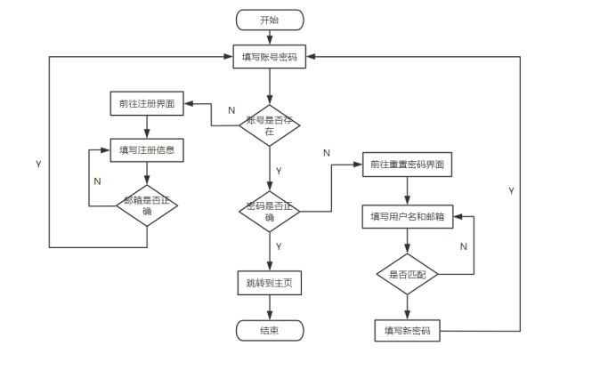

# 课程设计

## 一、网站设计题目
在线聊天系统

## 二、设计的目的及意义
### 1. 设计目的
在线聊天系统旨在为用户提供一个实时通信的平台，通过网络在不同设备之间进行消息的快速传递。该系统可以支持文本消息、文件传输、用户管理、私聊等功能，满足个人用户、企业和组织间的通信需求。其设计目的是创建一个高效、稳定、安全的聊天环境，使用户能够方便、快速地进行信息交流。
### 2. 设计意义
(1)提升沟通效率： 在线聊天系统允许用户以极低的延迟进行实时交流，打破了时间和空间的限制，大大提升了沟通的效率。
(2)用户体验优化： 随着互联网的发展，实时聊天成为了用户日常使用的主要通信方式。设计一个功能完善的聊天系统，可以改善用户体验，吸引并留住用户。
(3)信息管理与安全： 通过设计健全的用户管理与数据存储机制，可以保障用户信息的安全性与隐私性，并能进行记录、归档，便于追溯和管理。
(4)适应不同应用场景： 在线聊天系统不仅适用于社交类网站，还可用于在线客服、远程办公协作等场景，具有广泛的应用价值。

## 三、网站开发工具
Tomcat 10.0.28、idea、Mysql 8.0.32、Redis-x64-3.0.504、maven

## 四、网站需求分析
### 1. 功能性需求

用户注册与登录：

用户需要提供基本信息（如用户名、密码、邮箱）进行注册。
支持用户通过用户名和密码登录系统。
支持用户通过用户名和邮箱进行密码重置
管理员可以管理用户，包括删除、修改用户信息。

实时聊天功能：

用户可以通过聊天室进行群聊，消息实时更新。
支持私聊功能，用户可以选择好友进行一对一的私人聊天。
消息记录可以存储在服务器上，用户可以查看历史消息。

好友管理：

用户可以发送好友请求，并通过验证后建立好友关系。
用户可以查看在线好友列表，和好友进行私聊或删除好友。

消息存储与同步：

系统能够将聊天消息实时存储到数据库，并支持历史记录的查询。

用户状态管理：

用户可以通过登录来显示自己的在线状态，并能够在列表中显示其他用户的状态。

管理员可以查看所有用户的状态，方便监控与管理。

### 2. 非功能性需求

系统性能：

系统必须具备高并发处理能力，保证在多人同时聊天时仍能保持良好的响应速度。
通过优化数据库查询、使用缓存机制（如 Redis），确保系统具有较低的消息延迟。

安全性：

系统应具备权限管理功能，确保管理员与普通用户拥有不同的操作权限。
消息内容和用户信息的隐私保护必须到位，防止数据泄露。

可扩展性：

系统应具有良好的扩展性，便于后续增加更多功能（如视频通话、语音聊天等）。
支持多用户同时使用，能够根据用户规模的增长进行系统的横向或纵向扩展。

用户体验：

界面设计简洁直观，易于用户上手操作。
提供消息通知、好友请求提示等人性化设计，提升用户的使用体验。

稳定性与可靠性：

系统需要保证消息传输的可靠性，确保消息不丢失、无重复。
数据存储与备份机制健全，防止因系统故障或网络问题导致的消息丢失。
### 3. 技术需求

前端技术：

使用 HTML、CSS、JavaScript 构建用户界面，支持多浏览器兼容性。
利用 WebSocket 实现前端与服务器之间的实时通信。

后端技术：

使用 Java EE 框架构建后端服务，处理业务逻辑。
使用 WebSocket 技术实现消息的实时推送。

数据库：

使用 MySQL 等关系型数据库存储用户信息、聊天记录等数据。
使用 Redis 进行在线用户信息的临时存储，提升系统响应速度。

服务器与部署：

部署在本地服务器上，支持负载均衡与高可用性架构。
### 4. 用户需求

普通用户：

希望能够方便快捷地注册、登录系统，并能与好友实时交流。
希望系统稳定、流畅，能够随时查看消息记录。

管理员：

需要管理用户信息，并能监控系统运行状态。
可以查看所有用户的聊天记录，保障系统的安全性与合规性。

## 五、网站业务流程图

