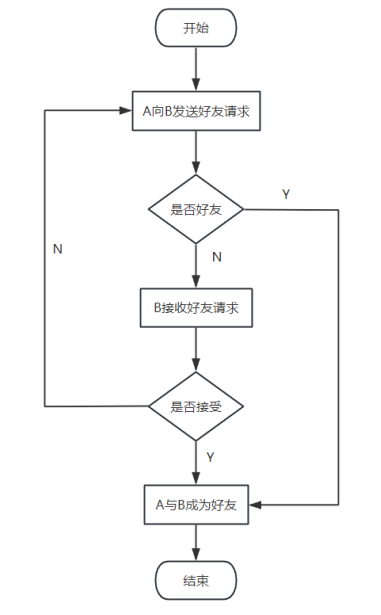
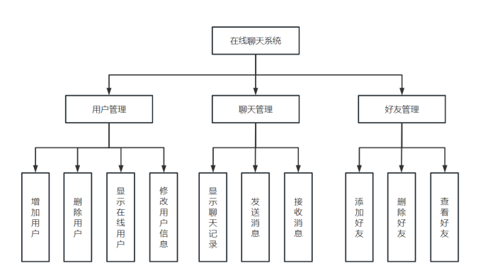
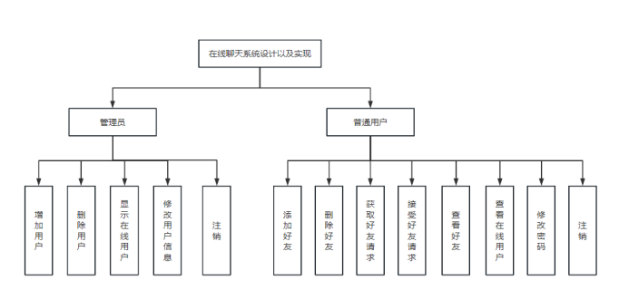
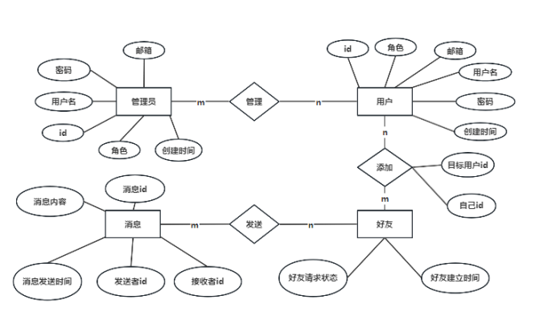
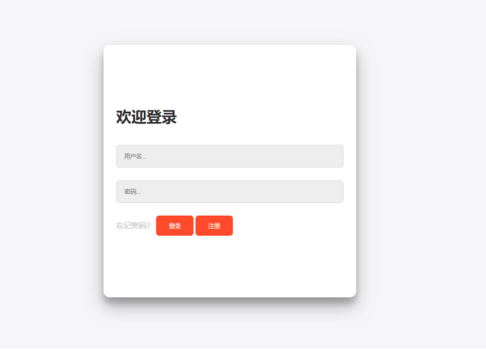
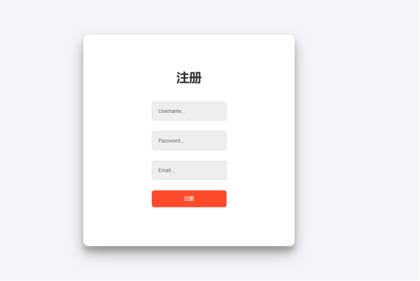
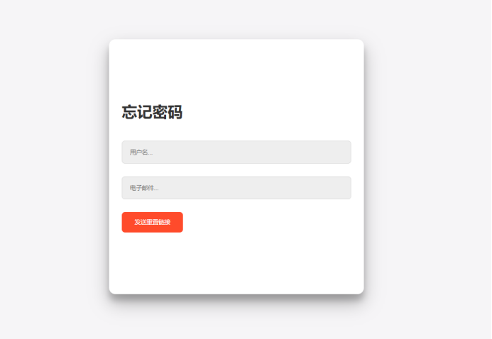
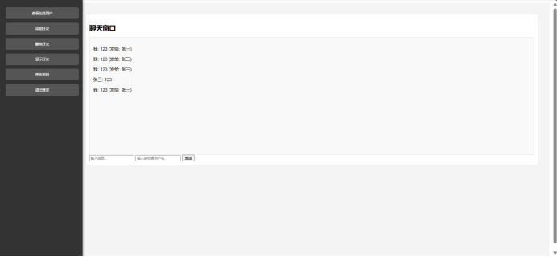
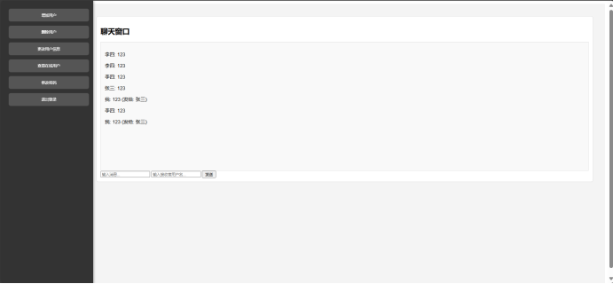

# 课程设计

## 一、网站设计题目
在线聊天系统

## 二、设计的目的及意义
### 1. 设计目的
在线聊天系统旨在为用户提供一个实时通信的平台，通过网络在不同设备之间进行消息的快速传递。该系统可以支持文本消息、文件传输、用户管理、私聊等功能，满足个人用户、企业和组织间的通信需求。其设计目的是创建一个高效、稳定、安全的聊天环境，使用户能够方便、快速地进行信息交流。
### 2. 设计意义
(1)提升沟通效率： 在线聊天系统允许用户以极低的延迟进行实时交流，打破了时间和空间的限制，大大提升了沟通的效率。
(2)用户体验优化： 随着互联网的发展，实时聊天成为了用户日常使用的主要通信方式。设计一个功能完善的聊天系统，可以改善用户体验，吸引并留住用户。
(3)信息管理与安全： 通过设计健全的用户管理与数据存储机制，可以保障用户信息的安全性与隐私性，并能进行记录、归档，便于追溯和管理。
(4)适应不同应用场景： 在线聊天系统不仅适用于社交类网站，还可用于在线客服、远程办公协作等场景，具有广泛的应用价值。

## 三、网站开发工具
Tomcat 10.0.28、idea、Mysql 8.0.32、Redis-x64-3.0.504、maven

## 四、网站需求分析
### 1. 功能性需求

用户注册与登录：

用户需要提供基本信息（如用户名、密码、邮箱）进行注册。
支持用户通过用户名和密码登录系统。
支持用户通过用户名和邮箱进行密码重置
管理员可以管理用户，包括删除、修改用户信息。

实时聊天功能：

用户可以通过聊天室进行群聊，消息实时更新。
支持私聊功能，用户可以选择好友进行一对一的私人聊天。
消息记录可以存储在服务器上，用户可以查看历史消息。

好友管理：

用户可以发送好友请求，并通过验证后建立好友关系。
用户可以查看在线好友列表，和好友进行私聊或删除好友。

消息存储与同步：

系统能够将聊天消息实时存储到数据库，并支持历史记录的查询。

用户状态管理：

用户可以通过登录来显示自己的在线状态，并能够在列表中显示其他用户的状态。

管理员可以查看所有用户的状态，方便监控与管理。

### 2. 非功能性需求

系统性能：

系统必须具备高并发处理能力，保证在多人同时聊天时仍能保持良好的响应速度。
通过优化数据库查询、使用缓存机制（如 Redis），确保系统具有较低的消息延迟。

安全性：

系统应具备权限管理功能，确保管理员与普通用户拥有不同的操作权限。
消息内容和用户信息的隐私保护必须到位，防止数据泄露。

可扩展性：

系统应具有良好的扩展性，便于后续增加更多功能（如视频通话、语音聊天等）。
支持多用户同时使用，能够根据用户规模的增长进行系统的横向或纵向扩展。

用户体验：

界面设计简洁直观，易于用户上手操作。
提供消息通知、好友请求提示等人性化设计，提升用户的使用体验。

稳定性与可靠性：

系统需要保证消息传输的可靠性，确保消息不丢失、无重复。
数据存储与备份机制健全，防止因系统故障或网络问题导致的消息丢失。
### 3. 技术需求

前端技术：

使用 HTML、CSS、JavaScript 构建用户界面，支持多浏览器兼容性。
利用 WebSocket 实现前端与服务器之间的实时通信。

后端技术：

使用 Java EE 框架构建后端服务，处理业务逻辑。
使用 WebSocket 技术实现消息的实时推送。

数据库：

使用 MySQL 等关系型数据库存储用户信息、聊天记录等数据。
使用 Redis 进行在线用户信息的临时存储，提升系统响应速度。

服务器与部署：

部署在本地服务器上，支持负载均衡与高可用性架构。
### 4. 用户需求

普通用户：

希望能够方便快捷地注册、登录系统，并能与好友实时交流。
希望系统稳定、流畅，能够随时查看消息记录。

管理员：

需要管理用户信息，并能监控系统运行状态。
可以查看所有用户的聊天记录，保障系统的安全性与合规性。

## 五、网站业务流程图

## 六、网站功能结构图

## 七、数据库设计

1.users表
| 列名       | 类型                  | 是否为空 | 键  | 默认值              | 额外信息          |
| ---------- | --------------------- | -------- | --- | ------------------- | ----------------- |
| id         | int                    | NO       | PRI |                     | auto_increment    |
| username   | varchar(50)            | NO       | UNI |                     |                   |
| password   | varchar(255)           | NO       |     |                     |                   |
| email      | varchar(100)           | NO       | UNI |                     |                   |
| role       | enum('user','admin')   | YES      |     | 'user'              |                   |
| created_at | timestamp              | YES      |     | CURRENT_TIMESTAMP   | DEFAULT_GENERATED |

2.chat_messages表
| 列名            | 类型      | 是否为空 | 键  | 默认值              | 额外信息          |
| --------------- | --------- | -------- | --- | ------------------- | ----------------- |
| message_id      | int       | NO       | PRI |                     | auto_increment    |
| sender_id       | int       | NO       |     |                     |                   |
| receiver_id     | int       | YES      |     |                     |                   |
| message_content | text      | NO       |     |                     |                   |
| sent_at         | datetime  | YES      |     | CURRENT_TIMESTAMP   | DEFAULT_GENERATED |

3.Friends表
列名	类型	是否为空	键	默认值	额外信息
| 列名       | 类型                               | 是否为空 | 键  | 默认值              | 额外信息                                       |
| ---------- | ---------------------------------- | -------- | --- | ------------------- | --------------------------------------------- |
| id         | int                                | NO       | PRI |                     | auto_increment                                |
| user_id    | int                                | NO       |     |                     |                                               |
| friend_id  | int                                | NO       |     |                     |                                               |
| status     | enum('pending','accepted','rejected') | YES      |     | 'pending'         |                                               |
| created_at | timestamp                          | YES      |     | CURRENT_TIMESTAMP   | DEFAULT_GENERATED                             |
| updated_at | timestamp                          | YES      |     | CURRENT_TIMESTAMP   | DEFAULT_GENERATED on update CURRENT_TIMESTAMP |

## 八、功能模块实现

## 九、系统存在的问题及系统优化方案
### 1. 性能问题
问题：

延迟和响应时间长：聊天消息传递延迟，用户体验不佳。
系统负载过高：系统在高并发情况下响应变慢或崩溃。
数据库性能瓶颈：频繁的读写操作导致数据库性能下降。

优化方案：

优化数据库查询：使用索引加速查询，优化 SQL 语句，减少数据库的负载。
消息缓存：使用 Redis 等缓存系统存储频繁访问的数据，减少数据库访问次数。
负载均衡：使用负载均衡器将请求分发到多个服务器，减少单台服务器的压力。
消息队列：使用消息队列（如 Kafka、RabbitMQ）处理高并发消息，解耦生产者和消费者。
WebSocket 连接优化：使用 WebSocket 提高实时性，减少 HTTP 请求的开销。
### 2. 用户体验问题
问题：

界面不友好：用户界面设计不够直观，操作复杂。
消息丢失：由于网络问题或系统崩溃，消息可能丢失。

优化方案：

用户界面优化：改进 UI 设计，确保界面简洁且易于操作，提供良好的用户体验。
消息持久化：将消息存储在数据库中，确保即使在系统崩溃后也不会丢失。
离线消息处理：提供离线消息功能，让用户在上线后可以查看未读消息。
### 3. 安全性问题
问题：

数据泄露：用户的个人信息或聊天记录被非法访问或泄露。
恶意攻击：如 SQL 注入、XSS 攻击等。

优化方案：

数据加密：对敏感数据（如聊天记录、用户信息）进行加密存储和传输，防止数据泄露。
安全验证：实现强认证机制（如 OAuth 2.0），确保用户身份的安全性。
输入验证：对用户输入进行严格验证，防止 SQL 注入和 XSS 攻击。
定期审计：定期进行安全审计和漏洞扫描，发现并修复潜在的安全问题。
### 4. 可维护性问题
问题：

代码质量差：代码缺乏注释和规范，难以维护。
系统难以扩展：系统架构设计不够灵活，难以添加新功能。

优化方案：

代码重构：定期重构代码，遵循编码规范和最佳实践，提高代码的可读性和可维护性。
模块化设计：将系统拆分成多个模块，确保每个模块功能独立，便于维护和扩展。
文档编写：编写详细的系统文档，包括代码注释、设计文档、API 文档等，帮助开发人员理解和维护系统。
自动化测试：实现自动化测试（单元测试、集成测试），确保系统在修改或扩展时不会引入新问题。
### 5. 用户管理和权限控制
问题：

权限管理不严：用户权限控制不准确，可能导致未授权访问。
账户管理问题：如账户被盗、密码泄露等。

优化方案：

细粒度权限控制：实现细粒度的权限控制机制，确保用户只能访问其授权的资源。
安全审计：记录用户操作日志，监控异常活动，及时发现并响应安全事件。
多因素认证：引入多因素认证（如短信验证码、邮件验证）提高账户安全性。
### 6. 系统稳定性问题
问题：

系统崩溃：系统由于某些原因崩溃，影响正常使用。
服务中断：系统服务无法正常提供，导致用户无法使用。

优化方案：

高可用性设计：使用集群和冗余设计，确保系统在单点故障时仍能继续提供服务。
自动恢复：实现系统监控和自动恢复机制，及时发现并修复系统故障。
容错处理：设计容错机制，如重试逻辑、失败转移，减少系统因部分组件故障而全面崩溃的风险。

